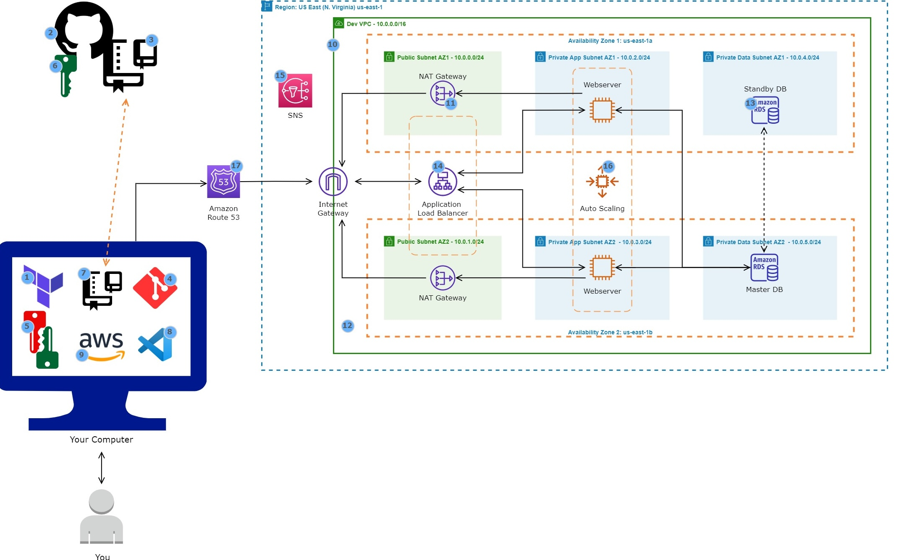

**Overview**

I recently completed a cloud architecture project where I deployed a highly available and scalable website on AWS using Terraform. This project involved setting up an automated infrastructure-as-code (IaC) environment to create and manage cloud resources efficiently. The objective was to simulate the deployment of a production-grade, secure, and resilient web application on AWS. I wanted to understand how to use Terraform to provision and manage AWS resources effectively while gaining hands-on experience with high availability, scalability, and secure network design. As someone who is still learning to code, this was also an opportunity to explore how far reference materials and a structured approach could take me. I leveraged Terraform reference guides to build my configurations. While I’m not yet proficient in coding, these resources were instrumental in helping me understand and apply best practices.

Below, I outline the steps I followed to build and deploy the website successfully.

**Architecture**
* **GitHub for Version Control** – Used GitHub to store and manage Terraform code, enabling version control and collaboration.
* **VPC (Virtual Private Cloud)** – Created a VPC with both public and private subnets across two Availability Zones for high availability.
* **Security Groups** – Configured Security Groups to enforce access control by opening only the required ports.
* **NAT Gateway** – Set up NAT Gateways in public subnets to enable private subnets to access the internet securely.
* **Application Load Balancer (ALB)** – Implemented an ALB to distribute web traffic across an Auto Scaling Group (ASG) of EC2 instances.
* **EC2 Instances** – Deployed EC2 instances in the private subnet within an Auto Scaling Group to ensure scalability and high availability.
* **MySQL RDS Database** – Configured a managed relational database for storing website data securely.
* **SNS (Simple Notification Service)** – Set up Amazon SNS to send notifications about key events, such as scaling activities.
* **Route 53** – Created a domain name record to manage website access through AWS Route 53.

**Steps to Deploy the Website**

1. **Environment Setup**
* Installed Terraform to manage AWS resources via Infrastructure-as-Code (IaC).
* Signed up for a GitHub account and created a repository to store Terraform scripts.
* Installed Git for version control and cloned the repository to the local system.
* Installed Visual Studio Code (VS Code) for writing and managing Terraform configurations.
* Installed AWS CLI to authenticate and manage AWS services programmatically.
* Generated SSH key pairs and added the public SSH key to GitHub for secure, passwordless authentication.

2. **Networking Configuration**
* Created a VPC with both public and private subnets across two Availability Zones.
* Configured an Internet Gateway to enable internet access for public-facing resources.
* Implemented NAT Gateways to allow private instances to access the internet securely.
* Defined Security Groups to control traffic to and from the EC2 instances, ALB, and database.

3. **Compute and Database Setup**
* Created an Auto Scaling Group (ASG) to launch and manage EC2 instances dynamically.
* Configured an Application Load Balancer (ALB) to distribute traffic evenly across EC2 instances.
* Deployed a MySQL RDS database for structured data storage and management.

4. **DNS and Monitoring**
* Registered a domain in Route 53 and configured a DNS record set to point to the ALB.
* Set up Amazon SNS for notifications on scaling activities and infrastructure events.

**Deployment Process**
1. Write Terraform Code – Created Terraform scripts for provisioning AWS resources.
2. Initialize Terraform – Ran terraform init to download the required provider plugins.
3. Plan Infrastructure – Used terraform plan to preview the changes before applying them.
4. Apply Changes – Executed terraform apply to create the cloud infrastructure.
5. Verify Deployment – Checked the AWS Console to confirm the successful setup.
6. Deploy Website Files – Connected to the EC2 instances and deployed the website files.

**Key Takeaways**
* Version control with GitHub ensures easy tracking of infrastructure changes.
* Networking setup (VPC, subnets, NAT, and security groups) is crucial for security and accessibility.
* Using ALB and Auto Scaling enhances website availability and resilience.
* RDS provides managed database services with automated backups and failover.
* Terraform simplifies infrastructure management, making it reproducible and scalable.

This project successfully demonstrated how to deploy a scalable and fault-tolerant website using AWS and Terraform. Future improvements can include implementing CI/CD pipelines for automated deployments and integrating monitoring solutions like CloudWatch and Prometheus.

Note: Terraform scripts were adapted from community and official reference guides. I am still building my coding skills, and this project was a significant step in progressing toward cloud architecture proficiency. Certain files have been removed for security reasons.
